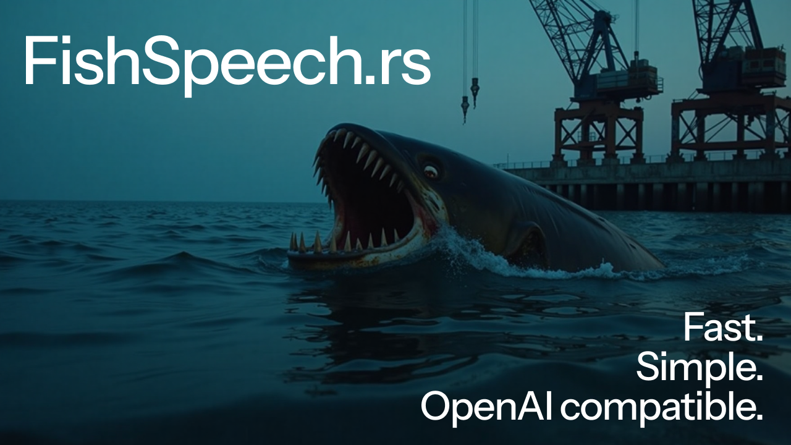

# fish-speech.rs



A simple, fast text-to-speech inference server for [Fish Speech](https://github.com/fishaudio/fish-speech) 1.5 and below, written in pure Rust.

Features:
- **Simple inference:** OpenAI-compatible server with streaming audio and WAV
- **Backwards compatibility:** now the only project still supporting Fish Speech 1.4 and 1.2 SFT
- **Reliable installation:** Compiles to single ~15MB static binary, no Python environment or `torch.compile` cache failures


## Prerequisites

- **Hardware:** Supports Nvidia, Apple Silicon, and CPU.
- **OS:** Linux or macOS are highly recommended. Windows and WSL work but are not yet officially supported: installation is much more difficult and performance on the same machine is slower.
- **System:** working Rust installation to compile from source ([see official docs](https://www.rust-lang.org/tools/install)). I'll try to remove this requirement ASAP.

## Compiling from source

> [!NOTE]
> Yes, compiling from source isn't fun.
> An official Docker image, Homebrew, Linux packaging, and Python interop layer are on the roadmap.
>
> If you want your platform supported, please feel free to raise an issue and I'll get on it!


First, clone this repo to the folder you want:

```bash
git clone https://github.com/EndlessReform/fish-speech.rs.git
cd fish-speech.rs
```

Now compile from source:

```bash
# Nvidia
cargo build --release --bin server --features cuda
# Apple Silicon
cargo build --release --bin server --features metal
```

For extra performance on Nvidia, you can enable [flash attention](https://github.com/Dao-AILab/flash-attention).
If you're compiling for the first time or after a major update though, this may take QUITE a while: up to 15 minutes and 16GB of RAM on a decent CPU.
You have been warned!

```bash
mkdir ~/.candle
CANDLE_FLASH_ATTN_BUILD_DIR=$HOME/.candle cargo build --release --features flash-attn --bin server
```

This will compile your binary to `./target/release/server`.

## Running the server

Just start the binary! If you're getting started for the first time, run:

```bash
# Default voice to get you started
./target/release/server --voice-dir voices-template
```

This will start the server on port 3000, using the pretrained models.

Options:
- `--port`: Defaults to 3000
- `--voice-dir`: Directory for speaker prompts. (more on this below)
- `--fish-version`: `1.5`, `1.4`, or `1.2`. Defaults to 1.5
- `--temp`: Temperature for language model backbone. Default: 0.7
- `--top_p`: Top-p sampling for language model backbone. Default 0.8, to turn off set it to 1.
- `--checkpoint`: Optional directory for checkpoint folder, if using fine-tune with merged weights, or custom model.

This server supports OGG audio (streaming) and WAV audio output.

You can use any OpenAI-compatible client. Here's an example Python request:

```python
from openai import OpenAI

client = OpenAI(
    base_url="http://localhost:3000/v1"
)
audio = client.audio.speech.create(
    input="Hello world!",
    voice="default",
    response_format="wav",
    model="tts-1",
)

temp_file = "temp.wav"
audio.stream_to_file(temp_file)
```

### Temporary voice cloning

To clone a voice, you'll need a WAV file and a transcription. Suppose you want to add speaker `alice`, who says "Hello world" in file `fake.wav`.

Make a POST request to the `/v1/audio/encoding` endpoint, with:
- fake.wav as file body
- `id` and `prompt` as URL-encoded query parameters

Example with curl:

```bash
curl -X POST "http://localhost:3000/v1/audio/encoding?id=alice&prompt=Hello%20world" \
  -F "file=@fake.wav" \
  --output alice.npy
```

You can check that your voice was added by hitting the `/v1/voices` debug endpoint:

```bash
curl http://localhost:3000/v1/voices
# Returns ['default', 'alice']
```

This will return a .npy file with your input audio as encoded tokens. After this, the `alice` voice will be usable _as long as the server is running_, and will be deleted on shutdown.

If you want to save this voice, you can use the `.npy` file returned to add it to the voices on startup: see below.


### Persisting cloned voices

> [!NOTE]
> Yes, this sucks. Persisting encoded voices to disk is a top priority.

Open up the `voices-template/index.json` file. It should look something like:

```json
{
  "speakers": {
    "default": "When I heard the release demo, I was shocked, angered, and in disbelief that Mr. Altman would pursue a voice that sounded so eerily similar to mine that my closest friends and news outlets could not tell the difference."
  }
}
```

The voices directory contains:
- **This index**, mapping speaker names to the text in their speaker conditioning audio
- **Speaker conditioning files**, where the filename is the _name_ of the speaker and the audio is the _speaker conditioning_ value (ex. `default.npy`)


Take the `.npy` file you got from runtime encoding and rename it to your speaker ID: ex. if the ID is "alice", then rename it to `alice.npy`.
Then move `alice.npy` to your voices folder. In `index.json`, add the key:

```json
{
  "speakers": {
    "default": "When I heard the release demo, I was shocked, angered, and in disbelief that Mr. Altman would pursue a voice that sounded so eerily similar to mine that my closest friends and news outlets could not tell the difference."
    "alice": "I–I hardly know, sir, just at present–at least I know who I WAS when I got up this morning, but I think I must have been changed several times since then."
  }
}
```

Restart the server and your new voice should be good to go.

## CLI scripts

For now, we're keeping compatibility with the official Fish Speech inference CLI scripts. (Inference server and Python bindings coming soon!)

### Generate speaker conditioning tokens

```bash
# saves to fake.npy by default
cargo run --release --features metal --bin encoder -- -i ./tests/resources/sky.wav
```

For earlier versions, you'll need to specify version and checkpoints manually:

```bash
cargo run --release --bin encoder -- --input ./tests/resources/sky.wav --output-path fake.npy --fish-version 1.2 --checkpoint ./checkpoints/fish-speech-1.2-sft
```

### Generate semantic codebook tokens

For Fish 1.5 (default):

```bash
# Switch to --features cuda for Nvidia GPUs
cargo run --release --features metal --bin llama_generate -- \
  --text "That is not dead which can eternal lie, and with strange aeons even death may die." \
  --prompt-text "When I heard the release demo, I was shocked, angered, and in disbelief that Mr. Altman would pursue a voice that sounded so eerily similar to mine that my closest friends and news outlets could not tell the difference." \
  --prompt-tokens fake.npy
```

For earlier versions, you'll have to specify version and checkpoint explicitly. For example, for Fish 1.2:

```bash
cargo run --release --features metal --bin llama_generate -- --text "That is not dead which can eternal lie, and with strange aeons even death may die." --fish-version 1.2 --checkpoint ./checkpoints/fish-speech-1.2-sft
```

For additional speed, compile with [Flash Attention](https://arxiv.org/abs/2205.14135) support.

> [!WARNING]
>
> The candle-flash-attention dependency [can take more than 10 minutes to compile](https://github.com/huggingface/candle/issues/2275) even on a good CPU, and can require more than 16 GB of memory! You have been warned.
>
> Also, of October 2024 the bottleneck is actually elsewhere (in inefficient memory copies and kernel dispatch), so on already fast hardware (like an RTX 4090) this currently has less of an impact.

```bash
# Cache the Flash Attention build
# Leave your computer, have a cup of tea, go touch grass, etc.
mkdir ~/.candle
CANDLE_FLASH_ATTN_BUILD_DIR=$HOME/.candle cargo build --release --features flash-attn --bin llama_generate

# Then run with flash-attn flag
cargo run --release --features flash-attn --bin llama_generate -- \
  --text "That is not dead which can eternal lie, and with strange aeons even death may die." \
  --prompt-text "When I heard the release demo, I was shocked, angered, and in disbelief that Mr. Altman would pursue a voice that sounded so eerily similar to mine that my closest friends and news outlets could not tell the difference." \
  --prompt-tokens fake.npy
```

### Decode tokens to WAV

For Fish 1.5 (default):

```bash
# Switch to --features cuda for Nvidia GPUs
cargo run --release --features metal --bin vocoder -- -i out.npy -o fake.wav
```

For earlier models, please specify the version. 1.2 example:

```bash
cargo run --release --bin vocoder -- --fish-version 1.2 --checkpoint ./checkpoints/fish-speech-1.2-sft
```

## License

> [!WARNING]
> This codebase is licensed under the original Apache 2.0 license. Feel free to use however you want. However, the Fish Speech weights are CC-BY-NC-SA-4.0 and for non-commercial use only!
>
> Please support the original authors by using the [official API](https://fish.audio/go-api/) for production.

This model is permissively licensed under the BY-CC-NC-SA-4.0 license.
The source code is released under Apache 2.0 license.

Massive thanks also go to:

- All `candle_examples` maintainers for highly useful code snippets across the codebase
- [WaveyAI's mel spec](https://github.com/wavey-ai/mel-spec) for the STFT implementation


## Original README below

# Fish Speech V1.5

**Fish Speech V1.5** is a leading text-to-speech (TTS) model trained on more than 1 million hours of audio data in multiple languages.

Supported languages:
- English (en) >300k hours
- Chinese (zh) >300k hours
- Japanese (ja) >100k hours
- German (de) ~20k hours
- French (fr) ~20k hours
- Spanish (es) ~20k hours
- Korean (ko) ~20k hours
- Arabic (ar) ~20k hours
- Russian (ru) ~20k hours
- Dutch (nl) <10k hours
- Italian (it) <10k hours
- Polish (pl) <10k hours
- Portuguese (pt) <10k hours

Please refer to [Fish Speech Github](https://github.com/fishaudio/fish-speech) for more info.
Demo available at [Fish Audio](https://fish.audio/).

## Citation

If you found this repository useful, please consider citing this work:

```
@misc{fish-speech-v1.4,
      title={Fish-Speech: Leveraging Large Language Models for Advanced Multilingual Text-to-Speech Synthesis},
      author={Shijia Liao and Yuxuan Wang and Tianyu Li and Yifan Cheng and Ruoyi Zhang and Rongzhi Zhou and Yijin Xing},
      year={2024},
      eprint={2411.01156},
      archivePrefix={arXiv},
      primaryClass={cs.SD},
      url={https://arxiv.org/abs/2411.01156},
}
```

## License

This model is permissively licensed under the BY-CC-NC-SA-4.0 license.
